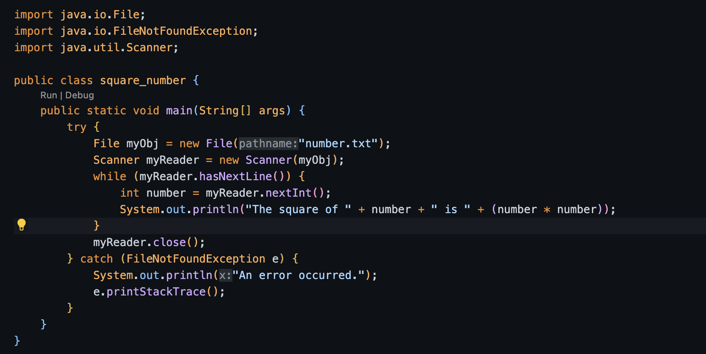
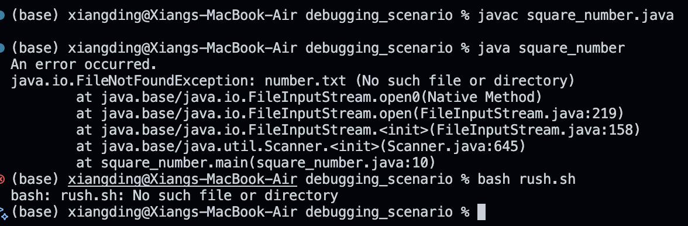
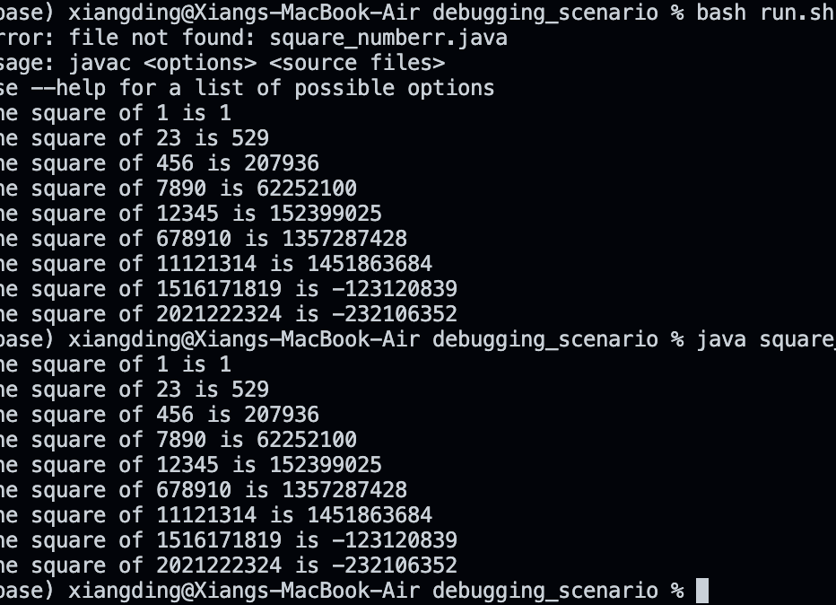

Original Post from a Student

Title: Issue with Running Java Program to Calculate Square of Number

Body:

Hello, I'm trying to run a Java program that reads a number from a file and prints its square. However, every time I try to run it with java and bash, I get a file not found error but the file does exist in my repo. I've attached a screenshot of the error and my terminal commands.

Screenshot:

Guess at the bug: 

I suspect the issue might have something to do with how the file is being read because the error occurs when trying to execute the Java program. Perhaps the file number.txt isn't being found or read correctly. I used the run.sh script to compile and run my Java program.

Failure-inducing input: 

I believe the input file number.txt is where things are going wrong, but I'm not sure if it's because of the contents of the file or its location.

Response from a TA
Body:

Hello! ensure the file number.txt is in the same directory as your Java program and check its contents to confirm it only contains a number.

Follow-up Post from the Student
Body:

Thanks for you help, the issues is indeed within the path to the txt file, I have put it in a different dir. Now I have fixed the issues.

Screenshot: 

Reflection:

In the latter part of this semester, I acquired a fundamental skill that has since reshaped my approach to handling projects: the ability to securely connect to remote servers using SSH (Secure Shell). This skill enabled me to access and work on files stored on the university's server without leaving my house. My journey into scripting also marked a significant leap in efficiency, as I learned to automate tasks that were previously time-consuming. This automation greatly accelerated my project workflow. Moreover, becoming proficient in terminal debugging was a milestone achievement for me. I mastered numerous commands and strategies that made identifying and fixing bugs much quicker and more intuitive. Another transformative skill I developed was using Vim for editing. Although its modal editing system initially seemed counterintuitive, gaining fluency in Vim's commands significantly boosted my coding speed and efficiency, largely because it reduced the need to use the mouse. These newly acquired skills have been indispensable not only for my laboratory assignments but also in enhancing my proficiency in software development.
